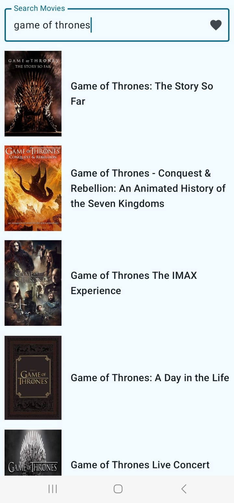
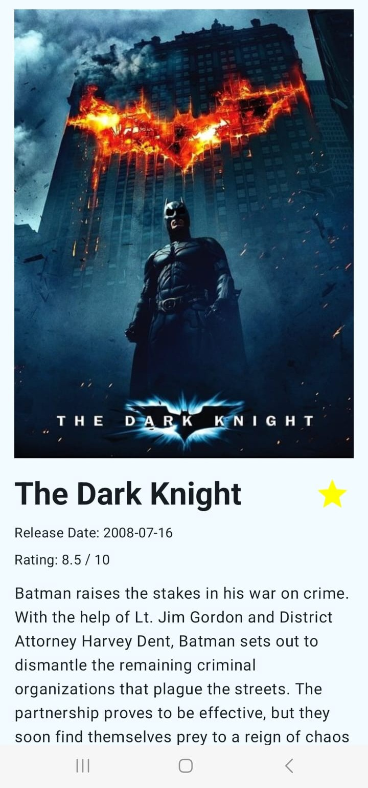

# Movie-Verse 🎬

A modern, feature-rich movie discovery app for Android, built entirely with Kotlin and Jetpack Compose. This project showcases modern Android development practices, including a reactive UI, robust architecture, and offline support.

## ✨ Features

- **Browse Popular Movies**: Infinitely scroll through a list of the most popular movies.
- **Real-time Search**: Find any movie with a debounced search that provides instant results as you pause typing.
- **Movie Details**: View detailed information for any movie, including its poster, summary, rating, and release date.
- **Offline Favorites**: Save your favorite movies to a local database and view them even without an internet connection.

## 📸 Screenshots

| Movie List & Search | Movie Details | Favorites |
| :---: |:---:|:---:|
|  |  |  |

## 🛠 Tech Stack & Architecture

This project is a showcase of modern Android development tools and best practices.

- **Core:** 100% [Kotlin](https://kotlinlang.org/) + [Coroutines](https://kotlinlang.org/docs/coroutines-overview.html) & [Flow](https://kotlinlang.org/docs/flow.html) for asynchronous operations.
- **UI:** [Jetpack Compose](https://developer.android.com/jetpack/compose) for declarative UI development.
- **Architecture**:
  - MVVM (Model-View-ViewModel)
  - Repository Pattern (via `RetrofitInstance`)
  - Clean Architecture principles
- **Networking:** [Retrofit2](https://square.github.io/retrofit/) & [OkHttp3](https://square.github.io/okhttp/) for efficient and clean API calls.
- **JSON Parsing:** [Kotlinx Serialization](https://github.com/Kotlin/kotlinx.serialization) for converting API data to Kotlin objects.
- **Navigation:** [Jetpack Navigation for Compose](https://developer.android.com/jetpack/compose/navigation) for moving between screens.
- **Image Loading:** [Coil](https://coil-kt.github.io/coil/) for loading and caching images from the internet.
- **Database:** [Room Persistence Library](https://developer.android.com/training/data-storage/room) for creating and managing the local offline database for favorites.

## 🔑 API

This project uses the [The Movie Database (TMDb) API](https://www.themoviedb.org/documentation/api).

### How to Add Your API Key
To run the app, you need your own free API key from the TMDb website.

1.  Get your API key from [TMDb](https://www.themoviedb.org/settings/api).
2.  Open the `MovieViewModel.kt` file.
3.  Find all the places that say `"YOUR_API_KEY_HERE"` and replace it with your actual key.
    *(Note: For a real production app, this key would be stored securely in a `local.properties` file, not directly in the code.)*

## 🚀 Setup & Installation

1.  Clone the repository: `git clone https://github.com/your-username/MovieVerse.git`
2.  Open the project in the latest version of Android Studio.
3.  Add your TMDb API key as described above.
4.  Build and run the app.

## 📄 License

This project is licensed under the MIT License.